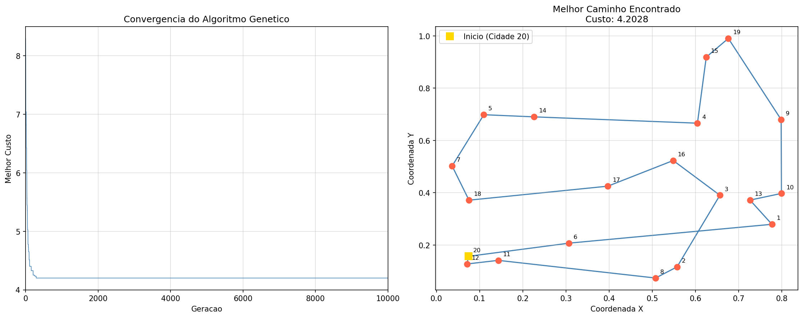

# 🧬 Algoritmo Genético — Problema do Caixeiro Viajante (TSP)

## 🌟 Sobre o Projeto
Este é um estudo prático de **Inteligência Artificial** focado na implementação do **Algoritmo Genético (AG)** aplicado ao clássico **Problema do Caixeiro Viajante (TSP)**. O objetivo é encontrar a rota mais curta que visita 20 cidades exatamente uma vez e retorna ao ponto de origem, usando técnicas inspiradas na teoria da evolução de Charles Darwin.

---

## 🚀 Funcionalidades

| **Funcionalidade** | **Descrição** |
|---|---|
| 🗺️ TSP com 20 cidades | Coordenadas reais fornecidas via `cidades.mat` |
| 🎯 Seleção por Roleta | Probabilidade inversamente proporcional à distância |
| 🔁 Crossover Cíclico (CX) | Preserva permutação sem gerar cidades duplicadas |
| 🔀 Mutação por Troca | Troca aleatória de duas cidades na rota |
| 👑 Elitismo 50% | Os melhores indivíduos sempre sobrevivem |
| 📊 Gráfico de Convergência | Evolução do melhor custo ao longo das gerações |
| 🗺️ Gráfico da Melhor Rota | Visualização do melhor caminho encontrado com cidades numeradas |
| 💾 Exportação | Salva o gráfico final em `resultado.png` |

---

## 🛠️ Tecnologias Utilizadas


- **Linguagem:** Python 3
- **Cálculo matricial:** NumPy (broadcast vetorizado)
- **Visualização:** Matplotlib

---

## 📂 Estrutura do Projeto

```
AlgoritmoGenetico/
├── DOCUMENTACAO_TECNICA.md        # Explicação detalhada de cada parte do código
├── README.md                      # Este arquivo
├── ag_pcv.py                      # Código principal (classe AlgoritmoGenetico + main)
├── algoritmo_genetico_tsp.ipynb   # Versão Jupyter Notebook com experimentos extras
├── cidades.mat                    # Coordenadas das 20 cidades
├── requirements.txt               # Dependências do projeto
└── resultado.png                  # Gráfico gerado após execução (criado ao rodar)
```

---

## 🧠 Como o Algoritmo Funciona

O AG simula a evolução biológica para encontrar boas soluções para o TSP:

```
População Inicial (20 rotas aleatórias)
        ↓
  Função de Aptidão (distância total)
        ↓
  Ordenação (menor distância = mais apto)
        ↓
  Elitismo: preserva os 10 melhores
        ↓
  Seleção por Roleta → Crossover CX → Mutação
        ↓
     Nova Geração
        ↓
  Repete por 10.000 gerações
        ↓
   Melhor solução encontrada
```

### Parâmetros

| Parâmetro | Valor |
|---|---|
| Tamanho da população | 20 indivíduos |
| Número de gerações | 10.000 |
| Elitismo | 50% (10 melhores) |
| Espaço de busca | Plano 1×1 com 20 cidades |

---

## 🎮 Como Executar

### Pré-requisitos
- Python 3.8 ou superior
- `cidades.mat` na mesma pasta que `main.py`

### Passo a passo

1. Clone ou baixe o repositório:
```bash
git clone https://github.com/seu-usuario/seu-repo.git
cd seu-repo
```

2. Crie e ative um ambiente virtual (recomendado):
```bash
python -m venv .venv

# Windows
.venv\Scripts\activate

# Linux/macOS
source .venv/bin/activate
```

3. Instale as dependências:
```bash
pip install -r requirements.txt
```

4. Execute:
```bash
python main.py
```

O programa imprime o relatório no console e abre dois gráficos: a curva de convergência e a melhor rota encontrada. O gráfico também é salvo como `resultado.png`.

> **Prefere Jupyter?** Também é possível executar o projeto pelo notebook `algoritmo_genetico_tsp.ipynb`, tanto localmente quanto pelo [Google Colab](https://colab.google/). O notebook inclui células extras para inspecionar o crossover cíclico e comparar diferentes números de gerações.

> **Nota:** Sem o arquivo `cidades.mat`, o código gera 20 cidades aleatórias com `seed=42` como fallback.

---

## 📊 Exemplo de Saída

```
-------------------------------------------------------
  Tamanho da Populacao : 20
  Numero de Cidades    : 20
  Geracoes             : 10000
-------------------------------------------------------

Populacao Inicial:
   1. [8, 11, 14, ...]  |  Custo: 10.5437
  ...

Melhor custo inicial : 9.0497

Populacao Final (ordenada por aptidao):
   1. [9, 19, 15, ...]  |  Custo: 3.7439
  ...

-------------------------------------------------------
  Melhor Custo   : 3.7439
  Melhor Solucao : [9, 19, 15, 14, 5, 7, 18, 17, 6, 20, ...]
-------------------------------------------------------
```

> O resultado varia a cada execução por causa da aleatoriedade do algoritmo — isso é esperado e normal.



---

## 🔧 Possíveis Melhorias

- ⚡ **Critério de parada antecipada:** encerrar quando o melhor custo não melhorar por N gerações
- 🧬 **Taxa de mutação variável:** reduzir mutação conforme o algoritmo converge
- 🔁 **Outros operadores de crossover:** testar OX (Order Crossover) ou PMX
- 🗂️ **Múltiplas execuções:** rodar N vezes e comparar distribuição dos resultados

---

## 🧑‍💻 Desenvolvedores

| <br>Guilherme Geisler | <br>Joyce K |
|:---:|:---:|
| [LinkedIn](https://www.linkedin.com/in/guilhermegeisler/) | — |

---

## 📧 Contato

Se tiver alguma dúvida ou sugestão, entre em contato:

- **Guilherme Geisler** — [guilherme.sgeisler@gmail.com](mailto:guilherme.sgeisler@gmail.com)

---

## 📄 Licença

Projeto para fins **educacionais e de estudo**.

---

Feito com ❤️ para explorar algoritmos evolutivos aplicados a problemas de otimização combinatória.
